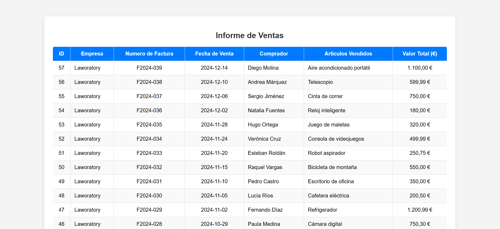
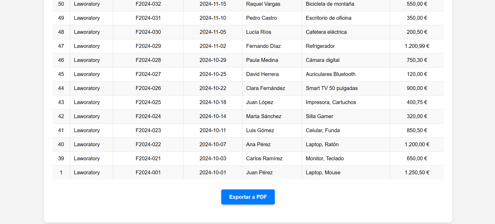
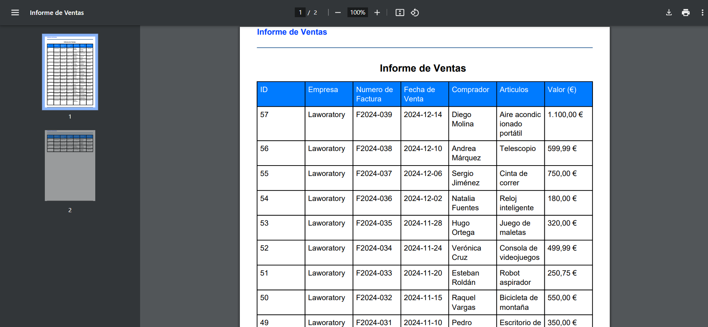

Informe de Ventas - PHP & MySQL

Este proyecto es un sistema web que muestra un informe de ventas del ultimo trimestre de 2024, utilizando PHP y MySQL.  
Ademas, permite exportar los datos a PDF con TCPDF.

---

Características

Conexion segura a MySQL con PDO.  
Extraccion y visualizacion de ventas en una tabla HTML bien organizada.  
Exportacion de informes a PDF.  
Manejo de errores en MySQL y seguridad contra inyecciones SQL.  

---

Requisitos
Servidor local como XAMPP o WAMP.  
PHP 8+
MySQL
Extensión TCPDF (incluida en la carpeta `tcpdf/`).  

---
Capturas de pantalla




Ejemplo de Reporte PDF


---

Como instalar y ejecutar el proyecto
Clonar el repositorio
```sh
git clone https://github.com/DanielBraca7/labChallenge.git
cd labChallenge

Configurar la base de datos
Abre phpMyAdmin (http://localhost/phpmyadmin/).
Crea una nueva base de datos con el nombre informe_ventas.
Ve a la pestaña Importar.
Selecciona el archivo registros/informe_ventas.sql y ejecuta.


